# Hospital Management System Pro (MedCore EHR Enterprise)

[](https://nestjs.com/)
[](https://reactjs.org/)
[](https://www.typescriptlang.org/)
[](https://www.mysql.com/)
[](https://tailwindcss.com/)
[](https://github.com/mikhailemad999/Hospital-Management-System.git)

> **Enterprise Multi-Branch Clinical & Financial Healthcare Management Platform**  
> Faithfully engineered according to the mission-critical specifications in [`recurmen.md`](./recurmen.md) and designed with the **Clinical Precision** design system inspired by [Auralis Clinical Telemetry](./stitch_remix_of_auralis_saas_landing_page).

---

## 🌐 Repository & Live Endpoints

- **GitHub Repository**: [https://github.com/mikhailemad999/Hospital-Management-System.git](https://github.com/mikhailemad999/Hospital-Management-System.git)
- **Frontend Workstation**: `http://localhost:5173`
- **NestJS REST API**: `http://localhost:4000/api/v1`
- **Interactive Swagger Docs**: `http://localhost:4000/api/docs`
- **Database**: Local MySQL on port **`3305`** (`hospital_pro_db`)

---

## 📸 Screenshots & Interactive Workstations

### 1. Staff Authentication & Specialist Persona Gate
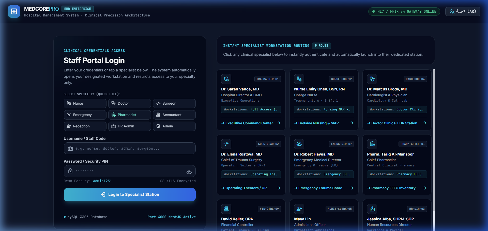

### 2. Executive Command Center — Real-Time Telemetry & KPIs
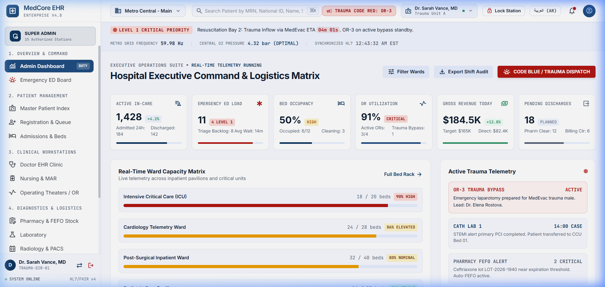

### 3. Emergency Trauma Board — ESI L1–L5 Triage Matrix
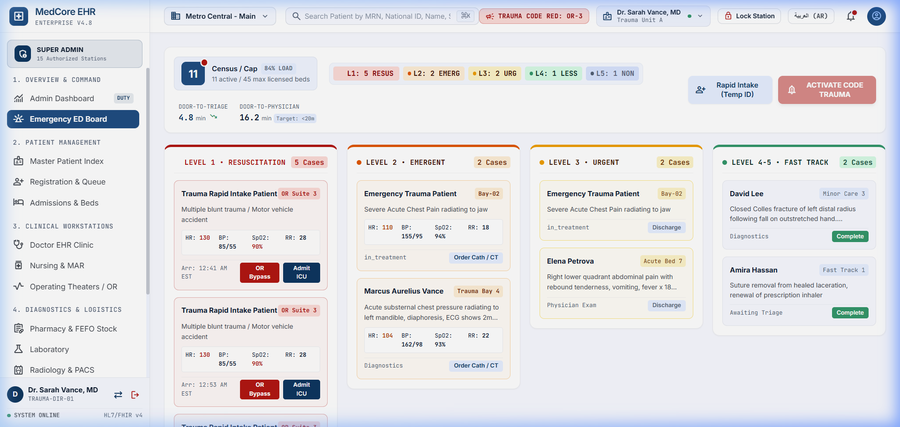

### 4. Doctor Clinical Workstation — SOAP Notes & e-Prescribing
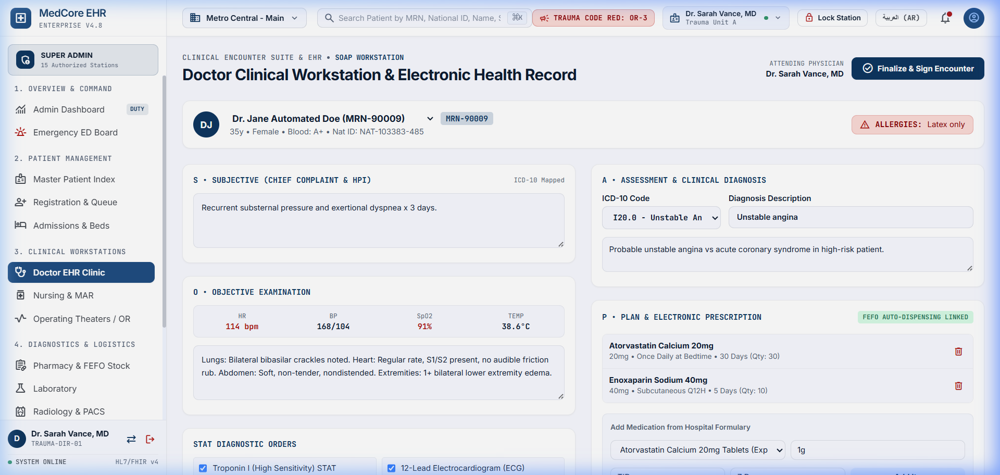

### 5. Bedside Nursing & e-MAR — Real-Time Vitals & Handover
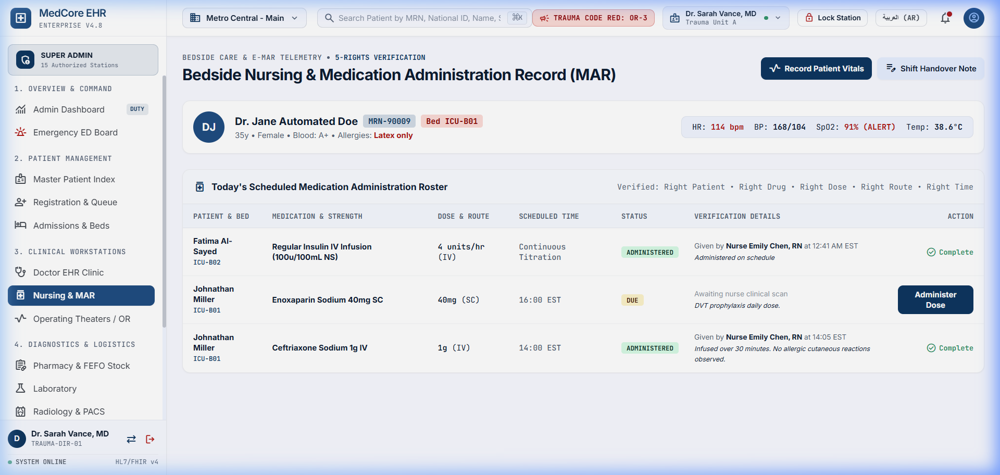

### 6. Pharmacy FEFO Stock — Expiry Countdown & Auto-Deduction
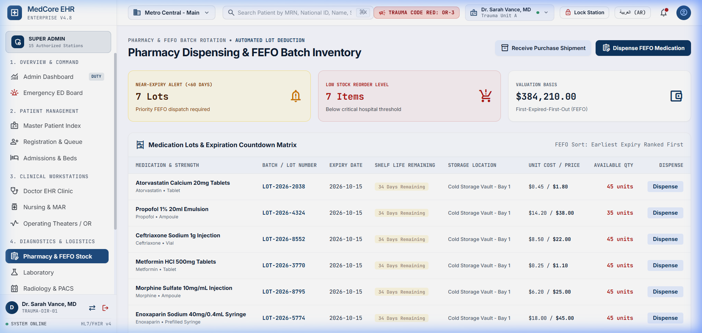

### 7. Operating Theaters & Surgical Suites (OR) — Utilization & Commissions
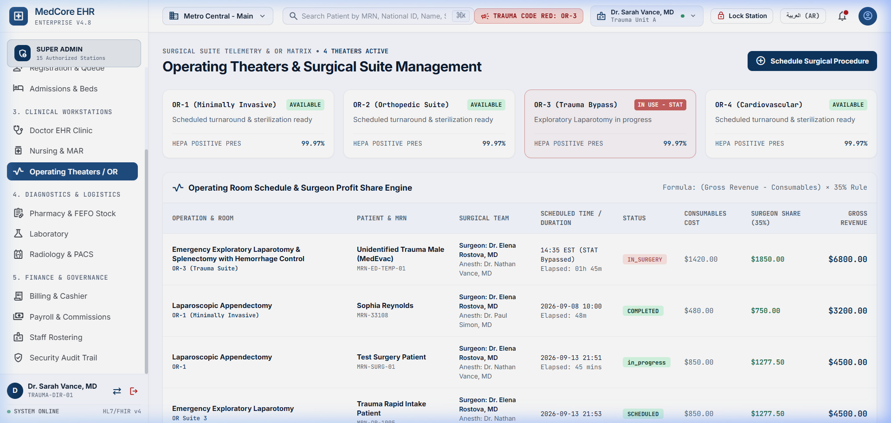

### 8. Outpatient Registration & Queue Dispenser — Digital Token System
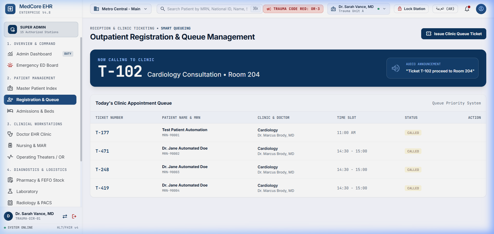

### 9. Patient Billing & Cashier Reconciliation — Shift Drawer Balancing
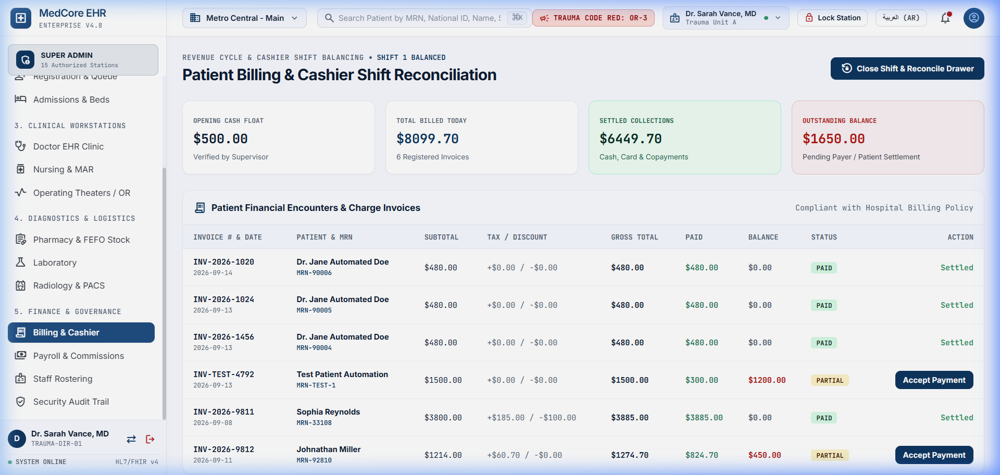

### 10. Radiology & PACS Viewer — DICOM Diagnostics & Diagnostic Reporting
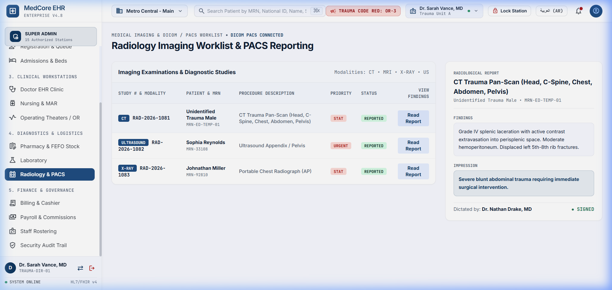

### 11. Security Audit Trail & HIPAA Compliance — Cryptographic Ledger
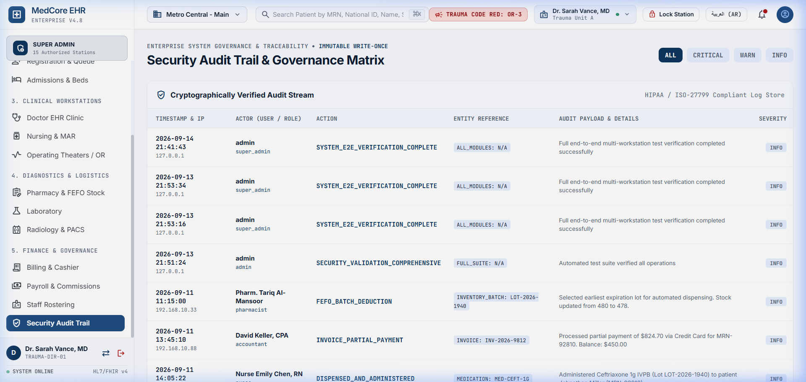

---

## 🩺 Clinical Roles & Workstation Auto-Routing Matrix

Every verified staff member is **automatically routed to their dedicated operational workstation** upon login, and receives an active **`DUTY`** badge on their primary station:

| Role | Username | Password | Staff Member & Title | Primary Duty Station | Auto-Routed Workstation URL / ID | Core Operational Functions |
| :--- | :--- | :--- | :--- | :--- | :--- | :--- |
| **CMO / Director** | `admin` | `Admin123!` | Dr. Sarah Vance, MD (Chief Medical Officer) | **Executive Command Center** | `admin-dashboard` | Real-time telemetry, 6 core KPIs, ward capacity matrix, code blue / trauma dispatch, HL7 monitor. |
| **Cardiologist / Doctor** | `doctor` | `Admin123!` | Dr. Marcus Brody, MD (Attending Physician) | **Doctor Clinical Station** | `doctor-clinic` | SOAP clinical notes, ICD-10 diagnosis selector, e-prescribing linked directly to FEFO auto-dispensing. |
| **Trauma ER Director** | `emergency` | `Admin123!` | Dr. Robert Hayes, MD (ER Medical Director) | **Emergency Trauma Board** | `emergency-ed-board` | Manchester/ESI L1–L5 triage, rapid trauma intake, MedEvac inflow tracking, STAT OR bypass alerts. |
| **Charge Nurse** | `nurse` | `Admin123!` | Nurse Emily Chen, BSN, RN (Charge Nurse) | **Bedside Nursing & MAR** | `nursing-and-mar` | Electronic Medication Administration Record (e-MAR), vital signs logger with abnormal telemetry warnings, shift handover notes. |
| **Chief Pharmacist** | `pharmacist` | `Admin123!` | Pharm. Tariq Al-Mansoor (Chief Pharmacist) | **Pharmacy FEFO Stock** | `pharmacy-and-fefo-stock` | Automated First-Expired-First-Out (FEFO) batch deduction, shelf-life expiry countdown matrix, purchase shipment reception. |
| **Lead Trauma Surgeon**| `surgeon` | `Admin123!` | Dr. Elena Rostova, MD (Chief of Trauma Surgery) | **Operating Theaters / OR** | `operating-theaters` | Surgical suite occupancy, surgical consumable lot tracking, doctor procedural commission calculations. |
| **Financial Controller**| `accountant` | `Admin123!` | David Keller, CPA (Billing Supervisor) | **Patient Billing & Cashier** | `billing-and-cashier` | Multi-currency billing, cashier shift drawer balancing ($500 opening float), automated payment collection & printable receipts. |
| **Admissions Officer** | `receptionist` | `Admin123!` | Maya Lin (Admissions Specialist) | **Outpatient Registration** | `patient-registration` | Patient registration, automated token ticketing, digital queue calling display with audio chime. |
| **HR / Payroll Manager**| `hr` | `Admin123!` | Jessica Alba, SHRM-SCP (HR Director) | **Staff Payroll & Commissions**| `payroll-and-commissions` | Biometric clock-in integration, base salary + allowances calculation, doctor procedural shares & PDF payslips. |

---

## 🏛️ System Architecture

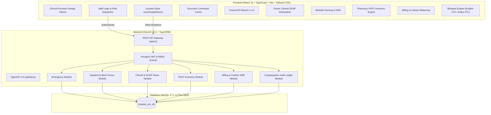

---

## 🎨 Clinical Precision Design System

The visual design system adheres strictly to the **Clinical Precision** standard:
- **Palette**:
  - `Deep Navy Slate`: `#0B1B3D` (Primary command structure)
  - `Surgical Precision Teal`: `#026C80` (Active states & links)
  - `Resuscitation Crimson`: `#BA1A1A` (STAT alerts & Level 1 emergencies)
  - `Signal Amber`: `#B26A00` (Warnings & medium acuity)
  - `Clinical White & Surface Grays`: `#F8FAFC`, `#EEF2F6`, `#E2E8F0`
- **Typography**:
  - **Inter**: Clean clinical and executive UI typography.
  - **JetBrains Mono**: High-precision telemetry, barcodes, vitals, lots, and MRN codes.
  - **Amiri / Noto Sans Arabic**: Native Arabic typography for complete RTL experience.
- **Bi-directional RTL Support**: Instant one-click switch between **English (LTR)** and **العربية (RTL)** layout with adapted navigation and text alignment.

---

## 🚀 Getting Started & Local Setup

### 1. Prerequisites
- **Node.js**: `v18+` or `v20+`
- **npm**: `v9+`
- **MySQL**: Running on port **`3305`**
  - Host: `localhost`
  - Port: `3305`
  - User: `root`
  - Password: `1234`
  - Database: `hospital_pro_db`

### 2. Database Initialization
Create the MySQL database on port `3305`:
```sql
CREATE DATABASE IF NOT EXISTS hospital_pro_db CHARACTER SET utf8mb4 COLLATE utf8mb4_unicode_ci;
```

### 3. Backend Setup (NestJS)
```bash
# Navigate to backend directory
cd backend

# Install dependencies
npm install

# Build TypeScript
npm run build

# Seed database with realistic clinical data & start server
node dist/main.js
```
The NestJS API will launch on:
- API Base: `http://localhost:4000/api/v1`
- Swagger Documentation: `http://localhost:4000/api/docs`

### 4. Frontend Setup (React + Vite)
```bash
# Navigate to frontend directory
cd frontend

# Install dependencies
npm install

# Launch development server
npm run dev -- --port 5173 --host
```
Open your browser at `http://localhost:5173`.

---

## ⚡ Core Workstations Breakdown

### 1. Executive Operations Suite & Command Matrix
- **Header Telemetry Ticker**: HL7/FHIR v4 connection status, metro power grid frequency (`59.98 Hz`), central medical O2 pipeline pressure (`4.32 bar`), and live trauma alerts.
- **Hospital KPI Metric Cards**: Active In-Care (`1,428`), Emergency ED Load (`6 active / 4 Level 1`), Inpatient Bed Occupancy (`50%`), Operating Suite Utilization (`91%`), Gross Revenue Today (`$184.5K`), Pending Discharges (`18`).
- **Ward Capacity Matrix**: Live capacity tracking for ICU, Cardiology, Surgery, and Pediatrics.

### 2. Emergency ED Board & Trauma Triage (L1–L5)
- **Acuity Level Spectrum**:
  - `L1 Resuscitation`: MedEvac trauma inflow, severe DKA, immediate OR bypass.
  - `L2 Emergent`: Acute chest pain, STEMI alerts, Cath Lab / CT ordering.
  - `L3 Urgent`: Abdominal pain, ultrasound and lab diagnostics.
  - `L4 Less Urgent` & `L5 Non-Urgent`: Fast track outpatient clinic routing.
- **Rapid Trauma Intake (Temp ID)**: Rapid intake modal for unidentified trauma walk-ins or MedEvac admissions.

### 3. Master Patient Index (MPI) & Medical Records
- Instant search by MRN (`MRN-11094`), National ID, or Patient Name.
- Critical allergy warning pills (e.g. *Latex*, *Iodine Contrast*, *Aspirin*, *NSAIDs*).
- Insurance verification breakdown and outstanding balance reconciliation.

### 4. Doctor Clinical Workstation & Electronic Health Record (EHR)
- Full **SOAP** documentation structure:
  - **S (Subjective)**: Chief complaint and HPI.
  - **O (Objective)**: Real-time vitals strip (HR, BP, SpO2, Temp) with abnormal flags.
  - **A (Assessment)**: ICD-10 diagnostic coding (`I20.0 - Unstable Angina`).
  - **P (Plan)**: E-prescribing tied directly into the pharmacy FEFO auto-dispensing engine.
- Encounter signing and cryptographic verification.

### 5. Bedside Nursing & e-MAR Telemetry
- Scheduled medication administration (scheduled doses, STAT doses).
- Vital signs logger synchronizing directly with central telemetry.
- Shift handover nursing notes recorder.

### 6. Pharmacy FEFO Dispensing & Batch Inventory
- **First-Expired-First-Out (FEFO)** batch allocation algorithm.
- Shelf-life countdown badges (e.g. *34 Days Remaining*).
- Near-expiry warning threshold (< 60 days) and minimum stock reorder triggers.
- Purchase order reception and stock movement ledger.

### 7. Operating Theaters & Surgical Suites (OR)
- Multi-suite OR scheduling (OR-1, OR-2, OR-3 Trauma Bypass).
- Consumable batch lot deduction (sutures, vascular grafts, laparotomy trays).
- Doctor surgical revenue commission calculations.

### 8. Patient Billing & Cashier Shift Balancing
- Financial encounters ledger (Invoices, copayments, discounts, taxes).
- Cashier shift drawer balancing ($500 opening float + collected cash/cards).
- Instant payment drawer checkout with printable hospital receipt.

### 9. Outpatient Registration & Queue Ticketing
- One-click token issuance for Clinics and Emergency triage.
- Digital queue calling display with auditory call chime.

### 10. Staff Payroll & Doctor Revenue Commissions
- Salary slips, hourly overtime, and procedure-based doctor commission splits.
- Biometric attendance clock-in integration simulator.

### 11. Cryptographic Security Audit Trail
- Non-repudiable audit ledger recording all clinical and financial mutations.
- Severity levels (`CRITICAL`, `WARNING`, `INFO`), user badges, IP addresses, and HMAC hashes.

---

## 🔒 Security & Data Integrity

- **Password Hashing**: Industry standard `bcrypt` hashing with salt rounds.
- **Stateless Authentication**: Cryptographically signed JWT tokens (`HS256`).
- **Database Transactions**: Financial and medication stock deductions are atomic using TypeORM transactions.
- **Audit Logging**: Every mutation creates an immutable audit record with timestamps, user ID, client IP, and before/after payloads.

---

## 👥 Authors & License

- **Author**: [Mikhail Emad](https://github.com/mikhailemad999)
- **License**: MIT License - Free for enterprise healthcare research and clinical adaptation.
